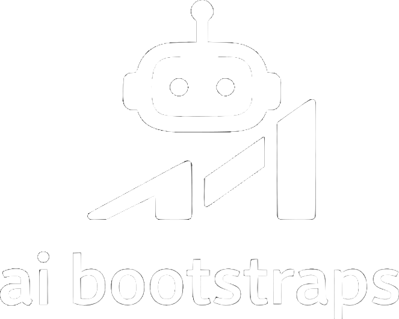

<p align="center">
  <picture>
    <source media="(prefers-color-scheme: dark)" srcset="./assets/logo-light.svg">
    <source media="(prefers-color-scheme: light)" srcset="./assets/logo-dark.svg">
    
  </picture>
</p>

<h1 align="center">ai bootstraps</h1>

<p align="center">
  Starter templates for agentic development workflows across Claude and Codex.
</p>

## Overview

This repository currently contains four bootstrap tracks:

1. `claude-batch-bootstrap/` — Python pipeline for Anthropic Message Batches.
2. `claude-nextjs-agency/` — Next.js + shadcn/ui + Claude multiagent setup.
3. `codex-nextjs-agency-v1/` — Codex multiagent profile (v1, specialist model).
4. `codex-nextjs-agency-v2/` — Codex multiagent profile (v2, functional workflow + skills).

## Repository Map

```text
.
├── README.md
├── docs/
│   ├── SPEC.md               # root technical specification
│   └── MANUAL.md             # operator manual
├── assets/
│   └── logo.svg
├── claude-batch-bootstrap/
│   ├── scripts/
│   ├── examples/
│   ├── SPEC.md
│   ├── MANUAL.md
│   └── README.md
├── claude-nextjs-agency/
│   ├── .claude/
│   ├── app/
│   ├── components/
│   ├── lib/
│   ├── tests/
│   ├── docs/SPEC.md
│   ├── bootstrap.sh
│   └── package.json
├── codex-nextjs-agency-v1/
│   ├── .codex/
│   └── AGENTS.md
└── codex-nextjs-agency-v2/
    ├── .codex/
    └── AGENTS.md
```

## Codebase Analysis Summary

- The repository is a **collection of independent templates**, not a single runnable app.
- `claude-batch-bootstrap` is a complete 5-step batch pipeline with clear file-based state transitions.
- `claude-nextjs-agency` is a runnable Next.js starter with strict conventions, hooks, and role-based `.claude` agents.
- `codex-nextjs-agency-v1` and `codex-nextjs-agency-v2` are configuration-focused bootstraps designed to be copied into existing Next.js projects.
- `codex-nextjs-agency-v2` is the most opinionated Codex setup, including skills under `.codex/skills/*` and a functional orchestration model.

## Notable Gaps Found

- `claude-nextjs-agency/bootstrap.sh` prints `/plan` and `/build` as available commands, but the actual command files are `/do`, `/architect`, `/integrate`, `/implement`, `/review`.
- Root-level naming in previous docs referenced old paths (`batch-bootstrap`, `multiagent-bootstrap`) while current directories are prefixed (`claude-*`, `codex-*`).

## Quick Start

### Claude Batch

```bash
cd claude-batch-bootstrap
python -m venv .venv && source .venv/bin/activate
pip install anthropic
export ANTHROPIC_API_KEY="sk-ant-..."

python scripts/01_prepare_batch.py --input examples/input.jsonl --output batch_payload.json
python scripts/02_submit_batch.py --payload batch_payload.json
python scripts/03_poll_status.py
python scripts/04_fetch_results.py --output results.jsonl
```

### Claude Next.js Agency

```bash
cd claude-nextjs-agency
pnpm install
pnpm typecheck
pnpm lint
pnpm test
pnpm dev
```

### Codex Agency Profiles

Copy the desired profile into your target Next.js project root:

- `codex-nextjs-agency-v1/.codex` + `codex-nextjs-agency-v1/AGENTS.md`
- `codex-nextjs-agency-v2/.codex` + `codex-nextjs-agency-v2/AGENTS.md`

## Project Docs

- Technical spec: [`docs/SPEC.md`](docs/SPEC.md)
- Manual: [`docs/MANUAL.md`](docs/MANUAL.md)
